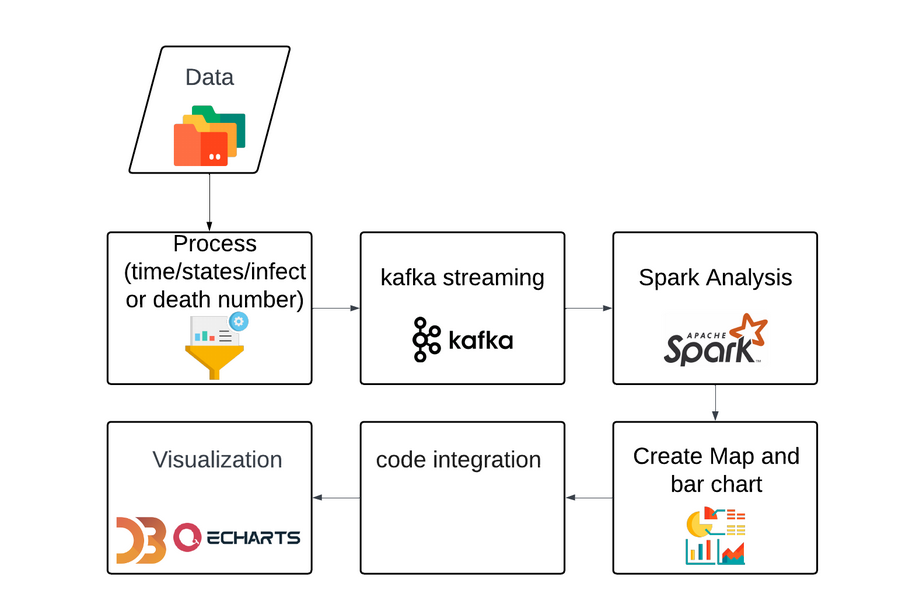

# Stream Processing Analysis on Covid-19 in the U.S

## Path

```
.
├── data(not included)
│   ├── us-counties-max.csv
│   └── us-counties-max.txt
│   └── us-counties-max-new.txt(filtered)
└── results
    └── result1-11.json
└── graph
	└── graph1-11.html
|
└──	1.html(Dynamic US Disease Map)
|
└── check.py(preprocess)
|
└── dashboard1.html(Dashboard)
|
└── transfer.py (csv -> txt)
|
└── echart1-11.py (plot)
|
└── zookeeper.py
|
└── zookeeper.bat
|
└── kafkaServer.py
|
└── kafkaServer.bat
|
└── kafkaProducer.py
|
└── kafkaConsumer.py(for task 1 and 2)
└── tasks.py(for other tasks)
	
```

## Workflow




### Preprocess

transfer.py

check.py

### Kafka Streaming

zookeeper.py

zookeeper.bat

kafkaServer.py

kafkaServer.bat

kafkaProducer.py

### Spark Analysis

kafkaConsumer.py(for task 1 and 2)

tasks.py(for other tasks)

### Create Map and bar chart

1.html (Dynamic US Disease Map)

echart1-11.py (plot)

### Code Integration and Visualization

dashboard1.html

## Video LInk

https://www.youtube.com/watch?v=x7hAxZ9HaAQ
